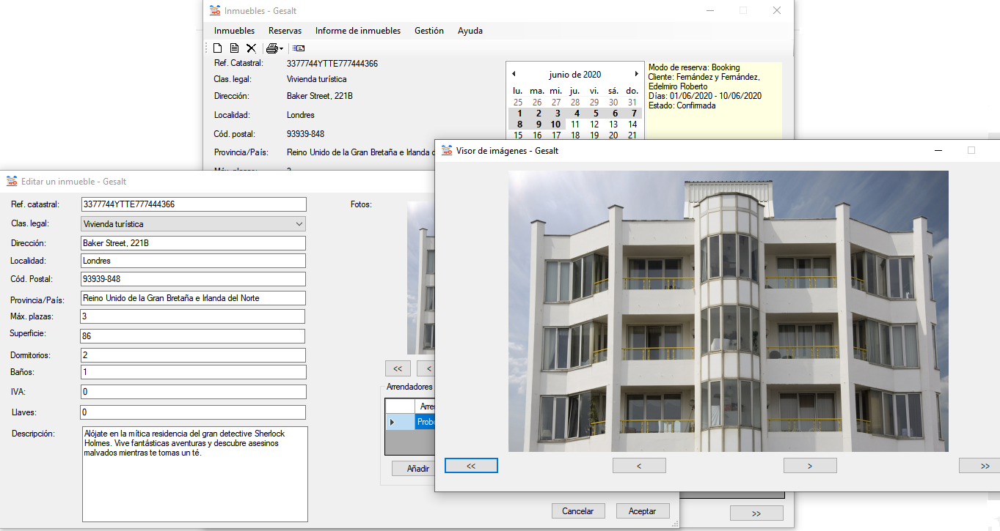

# Proyecto fin de ciclo

## Descripción

En los últimos años, el mercado de los alquileres turísticos ha crecido de manera exponencial. Cada vez es mayor el número de propietarios que optan por ofrecer sus viviendas de esta forma por su mayor rentabilidad económica. Sin embargo, este tipo de negocio tiene una serie de particularidades que hacen que su gestión sea más difícil que la del alquiler convencional.

Gesalt nace con el propósito de ayudar a propietarios o inmobiliarias a gestionar las viviendas destinadas a alquiler turístico ofreciendo las siguientes características:

* Operar con distintos propietarios
* Gestionar de forma centralizada los calendarios de reservas de sus propiedades
* Gestionar los clientes, independientemente de dónde hayan reservado la vivienda (en una web o directamente con el propietario/agencia)
* Expedir las facturas reglamentarias para esos clientes
* Permitir realizar valoraciones y comentarios sobre los clientes
* Enviar por email ofertas, promociones o cualquier otra información a los clientes ateniéndose a la ley de protección de datos

## Instalación / Puesta en marcha

Gesalt funciona en Windows e instalarlo es muy sencillo: ejecutar el instalador, **setup.msi**, y elegir la ubicación donde se va a instalar. Es muy recomendable que sea una carpeta que **no requiera permisos de acceso** (no utilizar *Archivos de programa*, por ejemplo), pues Gesalt no funcionará correctamente.

La primera vez que se ejecuta, Gesalt pide que se indique qué tipo de base de datos se usará: local o alojada en un servidor. Si se elige local, no hay nada más que hacer; el programa crea una base de datos vacía en la carpeta *Documentos/Gesalt* y aparece la pantalla principal para poder empezar a trabajar con él.

En caso de optar por una base datos alojada en un servidor (MySQL/MariaDB), hay que crearla previamente con la ayuda de un *script* que acompaña al programa y accesible desde *Todas las aplicaciones/Gesalt/Script MySQL*. Una vez creada la base de datos, al iniciar el programa por primera vez habrá que indicar los datos necesarios para crear la conexión (usuario, contraseña, dirección del servidor, etc.).

En este mismo repositorio, en la carpeta *Instalador*, se encuentra un fichero (*InstaladorDatosDemo.msi*) con el que se puede instalar una base de datos -en local- con datos de demostración e imágenes.

*Nota: Todas las imágenes de demostración son de libre distribución.*

## Uso

*Gesalt en uso*

La ventana principal del programa es la de gestión de inmuebles. En ella se pueden añadir, editar o borrar los inmuebles disponibles para alquiler, incluir fotos de la vivienda, etc.

En la parte superior derecha de la ventana hay un calendario de reservas. Las fechas ya reservadas aparecen en negrita; pulsando en ellas se obtiene información sobre la reserva y haciendo doble clic con el ratón o seleccionando un rango de fechas se puede añadir, editar, borrar, imprimir la factura (en caso de que su estado sea finalizada), etc.

Esto mismo se puede hacer desde el menú *Reservas*, además de gestionar los distintos modos en los que se puede reservar un inmueble (Booking, Airbnb, inmobiliaria...) y los precios y ofertas de cada modo.

Para que pueda haber reservas, tiene que haber clientes y la vivienda tener asociado un arrendador; de eso se encarga el menú *Gestión*. En este menú, también están las opciones para asignarle a cada inmueble su clasificación legal (vivienda de uso turístico, apartamento turístico...) y el *mailing*, con el que podremos mandar correos a todos los clientes que lo deseen.

En el menú *Ayuda* están las preferencias, para poder cambiar el tipo de base de datos, el idioma y los datos del correo electrónico para poder enviar los *mails* a los clientes.

## Sobre el autor

Apasionado de la informática y especialmente de la programación desde los tiempos de los 8 bits, cuando píxeles como puños centelleaban en televisores de tubo o monitores de fósforo verde y sólo a Dijkstra y sus filósofos se les atragantaba la cena al usar sentencias GOTO.

Autodidacta en los primeros tiempos, con un certificado de profesionalidad de programación de sistemas informáticos y (casi) técnico superior en DAM. Peleando con los sistemas operativos desde el viejo CP/M hasta los actuales Windows 10, Linux, Android...

**Lenguajes:** C/C++, C#, Visual Basic, Python, Java, PHP, SQL

**Contacto:** a18juancg@iessanclemente.net - jmcardeso@outlook.es

**¿Por qué Gesalt?**: Porque me permite trabajar con tecnologías como .NET con las que me siento cómodo, avanzando en su conocimiento al mismo tiempo que creo una aplicación que puede ser de utilidad.

## Licencia

Gesalt, Gestión de alquileres turísticos  
Autor: Juan Manuel Cardeso García

Este programa es software libre: puedes redistribuirlo y/o modificarlo bajo
los términos de la Licencia General Pública de GNU publicada por la Free
Software Foundation, ya sea la versión 3 de la Licencia, o (a tu elección)
cualquier versión posterior.

Este programa se distribuye con la esperanza de que sea útil pero SIN
NINGUNA GARANTÍA; incluso sin la garantía implícita de MERCANTIBILIDAD o
CALIFICADA PARA UN PROPÓSITO EN PARTICULAR. Lee la Licencia General Pública
de GNU para más detalles.

Has debido de recibir una copia de la Licencia General Pública
de GNU junto con este programa. Si no, ve a http://www.gnu.org/licenses/.

***

Icono de la aplicación diseñado por [Payungkead](https://www.flaticon.es/autores/payungkead) de [Flaticon](https://www.flaticon.es/)

Iconos de estrellas para valoración de clientes de [iconsDB](https://www.iconsdb.com/) - [CC0 1.0 Universal (CC0 1.0) Public Domain Dedication](https://creativecommons.org/publicdomain/zero/1.0/deed.es).

[ical.NET](https://github.com/rianjs/ical.net) - an open source iCal library for .NET

## Índice

1. [Idea](doc/templates/1_idea.md)
2. [Necesidades](doc/templates/2_necesidades.md)
3. [Diagramas](doc/diagramas.md)

## Guía de contribución

¿Deseas contribuir? Cualquier aportación es bienvenida. Sigue, por favor, [estas instrucciones](CONTRIBUTING.md).

